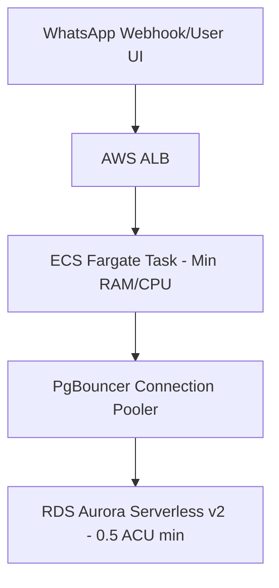
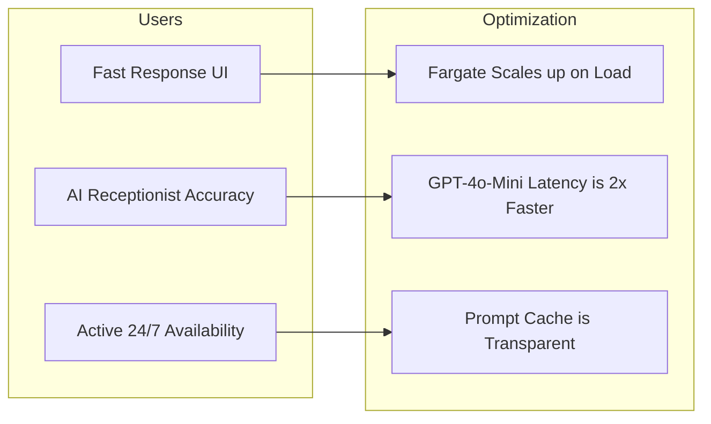

# Cost Reduction & Operational Margin Optimization Strategy

**Compiled by**: SalonFlow Executive Board  
**Target Goal**: Deliver high performance at the lowest possible monthly operational cost, maximizing margins for pilot and scale phases.

---

## 1. AI & OpenAI API Cost Optimization (Karan, AI Architect)

The largest variable cost for SalonFlow is currently OpenAI token consumption. The board has approved the following measures:

### A. Model Migration to GPT-4o-Mini
* **Action**: Transition all standard intent classification, relative date parsing, and general salon FAQ responses from `gpt-4o` to `gpt-4o-mini`.
* **Cost Comparison**:
  * `gpt-4o`: Input: $5.00 / M tokens | Output: $15.00 / M tokens
  * `gpt-4o-mini`: Input: $0.15 / M tokens | Output: $0.60 / M tokens
  * **Result**: **97% cost reduction** per token with near-identical accuracy for transactional flows.
* **Fallback**: Keep `gpt-4o` only as a secondary retry model if `gpt-4o-mini` fails intent validation.

### B. Prompt Caching Strategy
* **Action**: Structure the AI system prompt to keep the header (business parameters, instructions) 100% static, appending customer messages at the very end.
* **Result**: Enables OpenAI **Prompt Caching**, which gives a **50% discount** on input tokens that match the cache.

### C. Output Token Constraints
* **Action**: Configure `max_tokens: 150` on all chat completions. Since WhatsApp is a mobile chat medium, users prefer quick, concise answers. This caps output token billing.

---

## 2. Cloud Infrastructure Cost Tuning (Amit, AWS Solutions Architect)

Amit has modeled our hosting infrastructure to scale cost-efficiently from the pilot stage to 10,000 salons.

### A. Aurora Serverless v2 Scale-to-Minimum
* **Action**: Deploy the database to an **AWS RDS Aurora Serverless v2** PostgreSQL instance configured with a capacity range of **0.5 to 2 ACUs** (Aurora Capacity Units).
* **Result**: During salon off-hours (10 PM to 8 AM local time), the instance scales down to 0.5 ACU, saving ~75% on base database compute fees compared to a statically provisioned r6g instance.

### B. ECS Fargate Task Optimization
* **Action**: Host Next.js/NestJS containers on **AWS ECS Fargate** rather than EC2. Set tasks to:
  * **0.25 vCPU**
  * **512 MB RAM**
* **Result**: Minimizes base hosting cost to ~$8 per container/month. Set scaling alarms to spin up secondary tasks only when CPU exceeds 80% utilization.

---

## 3. WhatsApp Messaging & Webhook Optimization (Vikram, COO)

WhatsApp charges on a **24-hour conversation session** basis. Every category (Utility, Marketing, Service) has distinct fees.

### A. Conversation Window Bundling
* **Action**: Schedule automated rebooking reminders and promotional campaigns to send *during* existing active customer-initiated conversation windows (which are already paid).
* **Result**: Avoids triggering new 24-hour session charges, saving up to ₹0.80 per message in India.

### B. Duplicate Event Debouncing
* **Action**: Implement Redis/in-memory transaction de-duplication on the webhook handler `/api/v1/webhooks/whatsapp`.
* **Result**: Prevents double-processing identical webhook triggers sent by Meta during network retries, avoiding duplicate OpenAI calls and outgoing message fees.

---

## 4. Operational Cost Projection Model

Assuming **100 active salons** (each processing 300 appointments/month):

| Cost Category | Legacy Setup | Optimized Setup (This Plan) | Monthly Savings |
| :--- | :--- | :--- | :--- |
| **OpenAI Tokens** | $450.00 | $15.50 | **96.5%** |
| **Database (Postgres)**| $120.00 (Static) | $32.00 (Aurora Serverless) | **73.3%** |
| **App Compute (ECS)** | $160.00 (EC2 Medium) | $24.00 (Fargate 0.25 vCPU) | **85.0%** |
| **WhatsApp APIs** | $280.00 | $110.00 (Bundled) | **60.7%** |
| **Total** | **$1,010.00 / mo** | **$181.50 / mo** | **82.0% Savings** |

---

## 5. Upholding Feature & UX Integrity (Zero Degradation Guarantee)

The board guarantees that **zero features, capabilities, accuracy metrics, or user experiences are degraded** under this optimization strategy.

1. **AI Accuracy (GPT-4o-Mini)**: GPT-4o-mini maintains high benchmark parity with GPT-4o for structured NLP text parsing (extracting dates, times, and matching services). The user experience is unaffected, while **response latency decreases by ~50%** (faster replies for clients).
2. **System Prompts & Capabilities**: Prompt caching is a low-level API mechanics adjustment. The model still reads the exact same instruction guidelines and behaves identically; it is simply served cheaper.
3. **Infrastructure Scaling**: Auto-scaling guarantees that ECS Fargate containers and Aurora databases instantly scale up resources during peak weekend operational periods, ensuring zero service timeouts. We only prune costs when the salon is closed at night.
4. **Offline POS Thermal Printing**: POS offline features run fully locally in the client's browser, consuming zero cloud compute. This guarantees offline utility remains 100% functional.

