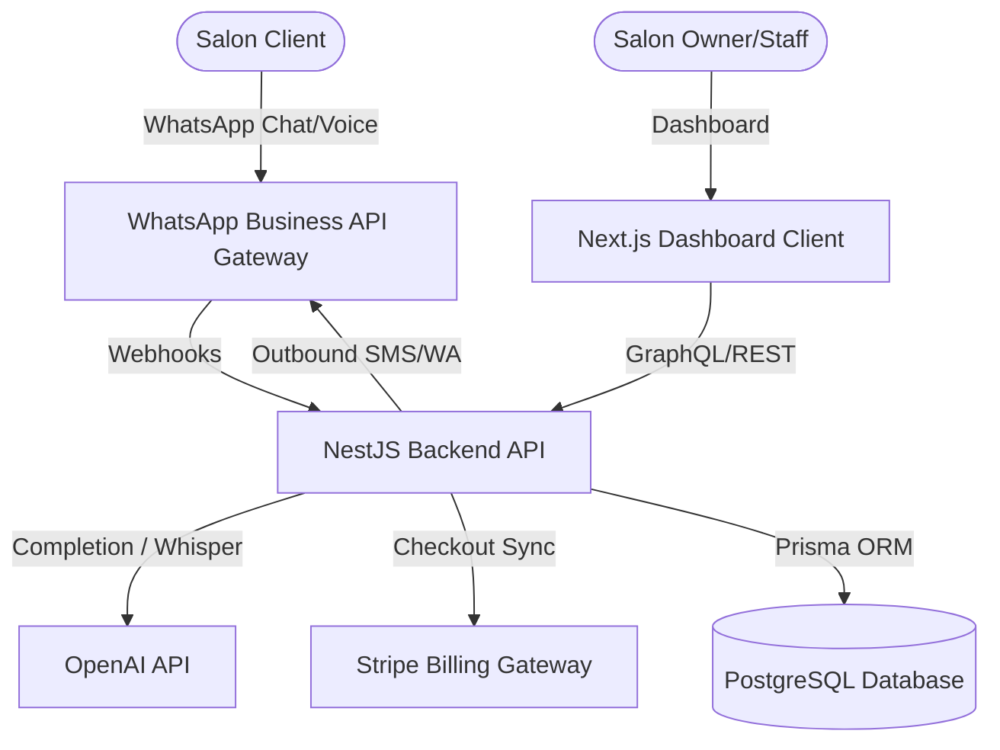
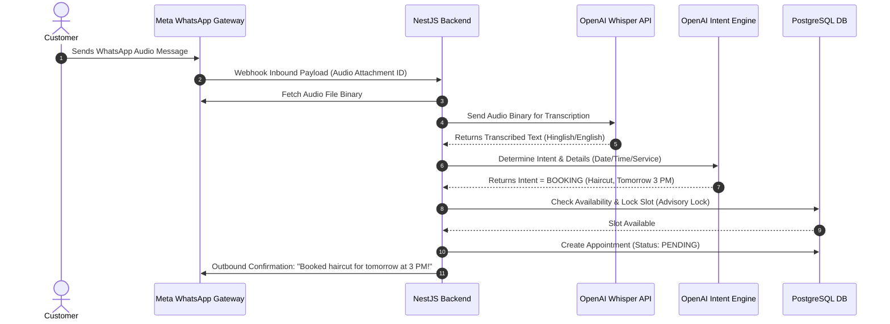

# Architecture Guide: SalonFlow SaaS Platform

This document outlines the system architecture, core services, data flow, AI receptionist pipeline, and WhatsApp messaging flow for SalonFlow.

---

## 1. System Topology

---

## 2. Core Service Modules (NestJS Backend)

### 📞 MissedCallController & Webhooks
*   **Path**: `backend/src/webhooks/missed-call.controller.ts`
*   **Role**: Ingests missed call callback events, registers them inside PostgreSQL, initiates new customer profiles if new, and triggers welcome templates.

### 🤖 AiService (Intent Classifier & Translation)
*   **Path**: `backend/src/ai/ai.service.ts`
*   **Role**: Handles intent classification (`BOOKING`, `FAQ`, `HUMAN_TAKEOVER`), extracts dates/times using OpenAI GPT function calls, transcribes voice notes via Whisper, and implements a regex-based local fallback parser.

### 🔄 RebookingsService (Recurrence Rules)
*   **Path**: `backend/src/rebookings/rebookings.service.ts`
*   **Role**: Evaluates completed appointments against recurrence interval rules (e.g. *Hair Spa -> 30 days*), queues rebooking recommendations, and handles auto-send cron schedules.

### ⭐ ReviewsService (Collect Reviews)
*   **Path**: `backend/src/reviews/reviews.service.ts`
*   **Role**: Scans completed bookings past the configured delay (e.g., 60 mins), constructs personalized request strings using AI, and routes them via WhatsApp.

---

## 3. WhatsApp Messaging Data Flow

The diagram below maps the sequence of an inbound voice note or text message from a customer:

