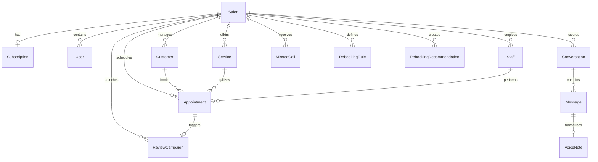

# Database Guide: SalonFlow SaaS Platform

This document describes the PostgreSQL database schema managed via Prisma ORM for the SalonFlow multi-tenant platform.

---

## 1. Multi-Tenant Architectural Isolation

SalonFlow enforces logical tenant separation using a shared-database, shared-schema pattern.
*   **Scoped Relationships**: Every critical entity (`User`, `Customer`, `Service`, `Staff`, `Appointment`, `Conversation`, `Campaign`, `MissedCall`, `ReviewCampaign`, `RebookingRule`, `RebookingRecommendation`) holds a direct foreign key field reference `salonId` pointing to `Salon(id)`.
*   **Cascade Deletion**: All `salonId` foreign keys are configured with `onDelete: Cascade` constraints, ensuring complete cleanup of all tenant-related entities if a salon account is removed.

---

## 2. Model Breakdown & Entity Relationships

### core Salon Management
*   **Salon**: Stores business name, address, WhatsApp credentials, AI Receptionist prompt instructions, and growth configurations (review delay, Google links, auto-send flags).
*   **Subscription**: Unified `1:1` mapping to `Salon` detailing stripe billing subscription plans (`FREE`, `BASIC`, `PRO`) and status codes (`ACTIVE`, `CANCELED`, `PAST_DUE`).
*   **User**: Salon employees with custom dashboard roles (`OWNER`, `MANAGER`, `RECEPTIONIST`). Scoped by `clerkId` string keys synced via auth sign-up webhooks.

### Scheduling & Customer CRM
*   **Customer**: Represents salon clients. Has a unique composite index constraint `@@unique([salonId, phone])` restricting duplicate numbers inside a single tenant.
*   **Service**: Details salon services (price, duration in minutes).
*   **Staff**: Identifies employees executing appointments.
*   **Appointment**: Connects Customer, Service, Staff, and Salon. Mapped to `Reminder` and `ReviewCampaign`.

### Messaging & Growth Logs
*   **Conversation & Message**: Stores real-time incoming and outgoing WhatsApp texts. Messages map to `VoiceNote` if transcribing audio.
*   **MissedCall**: Logs telco missed calls (`status`: `PENDING`, `CONVERSATION_STARTED`, `BOOKED`).
*   **ReviewCampaign**: Tracks dispatch times, redirection link clicks (`clickedAt`), and completion states.
*   **RebookingRule**: Maps services to recurring frequencies (interval days).
*   **RebookingRecommendation**: Mapped to customers and services representing scheduled reminders.
*   **VoiceNote**: Extends `Message` to house voice-to-text transcript output and media metadata (duration, file size, mime-type).

---

## 3. Database Indexes Strategy

To guarantee rapid query execution times across large multi-tenant datasets, index targets are created on lookup columns:
*   `MissedCall`: `@@index([salonId])`, `@@index([phone])`
*   `ReviewCampaign`: `@@index([salonId])`, `@@index([customerId])`
*   `RebookingRule`: `@@index([salonId])`
*   `RebookingRecommendation`: `@@index([salonId])`, `@@index([customerId])`

---

## 4. Entity Relationship Diagram (ERD)

