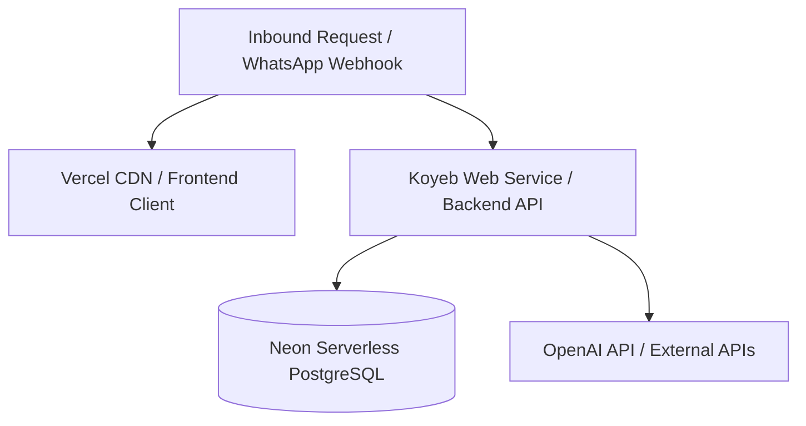

# Deployment Roadmap: SalonFlow SaaS Platform

This document details the step-by-step rollout and scaling roadmap for the SalonFlow platform. Written in collaboration with the BMad Specialist Agents (Amit, Rohan, Marcus, Priya, Arjun, Neha, Karan, Aditya, and Vikram), this plan guides the transition from a local sandbox environment to a highly scalable, multi-tenant cloud infrastructure.

For architectural and configuration foundations, refer to:
*   [ARCHITECTURE_GUIDE.md](file:///c:/Users/Devender%20Sharma/.gemini/antigravity/scratch/salonflow/docs/ARCHITECTURE_GUIDE.md) - Core components and system topology.
*   [DEPLOYMENT_GUIDE.md](file:///c:/Users/Devender%20Sharma/.gemini/antigravity/scratch/salonflow/docs/DEPLOYMENT_GUIDE.md) - Local setup steps and direct cloud deployment.
*   [aws_cost_projections.md](file:///c:/Users/Devender%20Sharma/.gemini/antigravity/scratch/salonflow/aws_cost_projections.md) - Infrastructure tier scaling costs.
*   [pre_launch_audit.md](file:///c:/Users/Devender%20Sharma/.gemini/antigravity/scratch/salonflow/pre_launch_audit.md) - Core capabilities scorecard and seed conditions.

---

## 1. Cloud Architecture Blueprint

The platform utilizes a highly efficient serverless PaaS architecture. Next.js is deployed to Vercel, NestJS is hosted on Koyeb (with Git-based compilation), and database state is managed via Neon Serverless PostgreSQL.



---

## 2. Rollout Timeline & Phases

This roadmap is divided into logical milestones, each requiring passing validation checks before advancing. *Note: In accordance with BMad operational standards, calendar dates and absolute time estimates are excluded to ensure focus remains strictly on quality gates and structural milestones.*

```mermaid
gantt
    title Rollout Roadmap Gates
    dateFormat  YYYY-MM-DD
    section Phases
    Phase 1: Foundation Setup & Infrastructure Provisioning :active, des1, 2026-06-12, 2026-06-15
    Phase 2: Closed Shadow Verification & Stress Dry-Run : des2, 2026-06-15, 2026-06-18
    Phase 3: Alpha Pilot Staged Onboarding (First 10 Salons) : des3, 2026-06-18, 2026-06-21
    Phase 4: High Growth Scale-Up (To 100 Salons) : des4, 2026-06-21, 2026-06-24
    Phase 5: Enterprise Elastic Durability (1,000+ Salons) : des5, 2026-06-24, 2026-06-27
```

### Phase 1: Secure Infrastructure Provisioning & Connection Setup
The core focus is establishing secure cloud hosting, setting up identity providers, and establishing live billing/communications pipelines.

1.  **AWS Aurora RDS PostgreSQL Setup**
    *   Provision AWS Aurora Serverless v2 in private database subnets.
    *   Configure connection strings utilizing connection pooling proxies (PgBouncer) for standard runtime queries.
    *   Expose direct DB connection URL to CI/CD pipeline variables exclusively for execution of [schema.prisma](file:///c:/Users/Devender%20Sharma/.gemini/antigravity/scratch/salonflow/backend/prisma/schema.prisma) migrations (`prisma migrate deploy`).
2.  **Clerk Production Identity Sync**
    *   Transition Clerk dashboard instance to live mode; register custom salon domains to Clerk API endpoints.
    *   Point Clerk `user.created` callback hook to production API route [clerk-webhook.controller.ts](file:///c:/Users/Devender%20Sharma/.gemini/antigravity/scratch/salonflow/backend/src/webhooks/clerk-webhook.controller.ts) to provision database records inside [clerk-webhook.service.ts](file:///c:/Users/Devender%20Sharma/.gemini/antigravity/scratch/salonflow/backend/src/webhooks/clerk-webhook.service.ts) automatically.
3.  **Stripe Production Live Integration**
    *   Define Stripe live environment keys in production configs.
    *   Map Stripe webhook signatures checking to [stripe-webhook.controller.ts](file:///c:/Users/Devender%20Sharma/.gemini/antigravity/scratch/salonflow/backend/src/webhooks/stripe-webhook.controller.ts) using the NestJS raw body configuration enabled in [main.ts](file:///c:/Users/Devender%20Sharma/.gemini/antigravity/scratch/salonflow/backend/src/main.ts).
    *   Validate premium feature gates in subscription sync service [stripe-webhook.service.ts](file:///c:/Users/Devender%20Sharma/.gemini/antigravity/scratch/salonflow/backend/src/webhooks/stripe-webhook.service.ts).
4.  **Meta WhatsApp Business Account Verification**
    *   Provide Business Verification documents to Meta Business Manager to transition from the sandbox number to a dedicated production phone number ID.
    *   Configure live Meta callback endpoints pointing to backend controllers.
5.  **DNS, SSL, & CORS Configuration**
    *   Deploy frontend application on Vercel utilizing global CDN edge caching.
    *   Configure Next.js environment pointers (`NEXT_PUBLIC_API_URL`) to target backend ALB domain.
    *   Set up CORS policies in NestJS backend [main.ts](file:///c:/Users/Devender%20Sharma/.gemini/antigravity/scratch/salonflow/backend/src/main.ts) restricting origins strictly to authorized subdomains.

> [!IMPORTANT]
> **Phase 1 Exit Gate (Validation Checkpoint)**
> *   All automated Jest tests pass with 100% success.
> *   Clerk webhook provisioning succeeds on simulated signup requests.
> *   Secure CORS rules are validated using external curl requests.
> *   Database tables are created with `salonId` tenant indices mapping correctly.

---

### Phase 2: Closed Shadow Verification & Stress Dry-Run
Validating AI booking correctness and platform concurrency performance before connecting live business accounts.

1.  **AI Voice Note Transcription Audit**
    *   Validate OpenAI Whisper integration performance in [ai.service.ts](file:///c:/Users/Devender%20Sharma/.gemini/antigravity/scratch/salonflow/backend/src/ai/ai.service.ts) using Hinglish voice notes.
    *   Audit token costs and prompt caching logs to verify latency is within expectations.
2.  **Double-Booking Lock Verifications**
    *   Run stress tests executing concurrent booking requests for overlapping slots.
    *   Verify PostgreSQL transaction advisory locks block parallel reservations, preventing database conflicts.
3.  **Load Testing (Pre-Launch Baseline)**
    *   Execute load runs utilizing `k6` to simulate concurrent POS checkouts and inbound missed call hooks in [missed-call.controller.ts](file:///c:/Users/Devender%20Sharma/.gemini/antigravity/scratch/salonflow/backend/src/webhooks/missed-call.controller.ts).
    *   Monitor database CPU scales under peak concurrent simulation.

> [!IMPORTANT]
> **Phase 2 Exit Gate (Validation Checkpoint)**
> *   0 transaction collisions or double-booking conflicts occurred during concurrent load tests.
> *   OpenAI transcription pipelines process Hinglish/English voice notes with >90% parsing accuracy.
> *   API request latencies stay under the target SLA threshold.

---

### Phase 3: Alpha Pilot Staged Onboarding (First 10 Salons)
Deploying the platform for the first 10 pilot salons to monitor usability and initial billing metrics in the field.

1.  **Pilot Salon Configuration Templates**
    *   Set up salon services catalog, configure staff commissions rates, and establish cash drawer parameters.
    *   Onboard stylists and verify staff dashboard views.
2.  **Cash drawer Logs Verification**
    *   Validate physical drawer closures daily by matching actual POS transactions with registered `CashDrawerLog` records.
    *   Verify 80mm browser thermal receipts styling compiles cleanly for local physical receipt printers.
3.  **Cron Scanner Automation Run**
    *   Enable automatic daily schedules to scanning completed bookings and generate personalized SMS/WhatsApp review collections.
    *   Monitor customer click-through redirects processing on [review-click.controller.ts](file:///c:/Users/Devender%20Sharma/.gemini/antigravity/scratch/salonflow/backend/src/webhooks/review-click.controller.ts) to update campaign metrics.

> [!IMPORTANT]
> **Phase 3 Exit Gate (Validation Checkpoint)**
> *   10 active salons successfully register POS transactions and complete daily cash drawer audits.
> *   Automated review campaign notifications are dispatched without manual triggers.
> *   Subscription plan limits trigger warning alerts if basic/pro parameters are exceeded.

---

### Phase 4: High Growth Scale-Up (To 100 Salons)
Expanding features to support multi-location business operations and automate payroll/transfers.

1.  **Multi-Outlet Organization Hierarchy**
    *   Enhance database schemas and repositories to group multiple `salonId` entities under a master tenant management organization.
    *   Update Next.js layouts to allow quick context switching between outlets for multi-salon owners.
2.  **Automated Commission Payouts Integration**
    *   Integrate payouts processor APIs (e.g. RazorpayX) to transfer calculated staff commissions directly to stylists' bank accounts upon owner approval.
3.  **VAPT Security Audit Compliance**
    *   Conduct automated vulnerability analysis and penetration testing.
    *   Validate cross-tenant isolation rules to prevent IDOR (Insecure Direct Object Reference) exploits across all backend services.

> [!IMPORTANT]
> **Phase 4 Exit Gate (Validation Checkpoint)**
> *   Cross-tenant API queries confirm clean organization isolation.
> *   Stylist payouts sync directly with ledger statements and calculate correct deductions.
> *   External security audit signs off with 0 high-risk vulnerabilities.

---

### Phase 5: Enterprise Elastic Durability (To 1,000+ Salons)
Optimizing operational compute costs and platform availability for large-scale production volumes.

1.  **Offline-First POS Caching Mode**
    *   Configure service worker caching in the Next.js frontend client to save catalog data locally.
    *   Implement client-side checkout queueing, syncing transactions to backend database once active internet connection is restored.
2.  **Koyeb Scaling & Database Optimization**
    *   Set up Koyeb auto-scaling rules to adjust active worker count based on CPU/memory usage.
    *   Configure Neon database autoscaling and auto-suspend thresholds for inactive tenants during off-peak hours (12 AM - 6 AM IST) to control database usage costs.

> [!IMPORTANT]
> **Phase 5 Exit Gate (Validation Checkpoint)**
> *   POS client checks out customers and prints receipts during simulated internet disconnection.
> *   Koyeb & Neon serverless billing verifies compute and storage scales to zero when idle.

---

## 3. Specialist Ownership Matrix

| Specialist Agent | Core Area of Responsibility | Target Verification Artifact |
| :--- | :--- | :--- |
| **Winston (CTO)** | Platform Architecture, Database Migration, and API Services | [ARCHITECTURE_GUIDE.md](file:///c:/Users/Devender%20Sharma/.gemini/antigravity/scratch/salonflow/docs/ARCHITECTURE_GUIDE.md) |
| **Rohan (DevOps SRE)** | Git integration setup, CI/CD builds, and webhook logs | [DEPLOYMENT_GUIDE.md](file:///c:/Users/Devender%20Sharma/.gemini/antigravity/scratch/salonflow/docs/DEPLOYMENT_GUIDE.md) |
| **Amit (AWS Solutions)** | PaaS scales, Neon Serverless parameters, and cloud compute cost control | [aws_cost_projections.md](file:///c:/Users/Devender%20Sharma/.gemini/antigravity/scratch/salonflow/aws_cost_projections.md) |
| **Marcus (Security)** | IDOR protection verification, CORS validation, and raw-body encryption audit | [pre_launch_audit.md](file:///c:/Users/Devender%20Sharma/.gemini/antigravity/scratch/salonflow/pre_launch_audit.md) |
| **Neha (QA Lead)** | Automated test coverage, concurrency checks, and `k6` load runs | [pre_launch_audit.md](file:///c:/Users/Devender%20Sharma/.gemini/antigravity/scratch/salonflow/pre_launch_audit.md) |
| **Priya (Frontend)** | Vercel optimizations, local storage POS sync, and receipt printing | [FEATURE_STATUS_DASHBOARD.md](file:///c:/Users/Devender%20Sharma/.gemini/antigravity/scratch/salonflow/docs/FEATURE_STATUS_DASHBOARD.md) |
| **Arjun (Backend)** | Webhook handlers, Prisma ORM transactions, and PgBouncer integration | [schema.prisma](file:///c:/Users/Devender%20Sharma/.gemini/antigravity/scratch/salonflow/backend/prisma/schema.prisma) |
| **Aditya (Growth)** | Stripe billing plan configurations and RazorpayX integration | [epic-6-retrospective.md](file:///c:/Users/Devender%20Sharma/.gemini/antigravity/scratch/salonflow/epic-6-retrospective.md) |
| **Karan (AI Specialist)** | Hinglish intent classification, Whisper translations, and OpenAI prompt caching | [ARCHITECTURE_GUIDE.md](file:///c:/Users/Devender%20Sharma/.gemini/antigravity/scratch/salonflow/docs/ARCHITECTURE_GUIDE.md) |
| **Vikram (COO)** | Pilot onboarding checkpoints, physical cash drawer audits | [coo_operations_report.md](file:///c:/Users/Devender%20Sharma/.gemini/antigravity/scratch/salonflow/coo_operations_report.md) |
