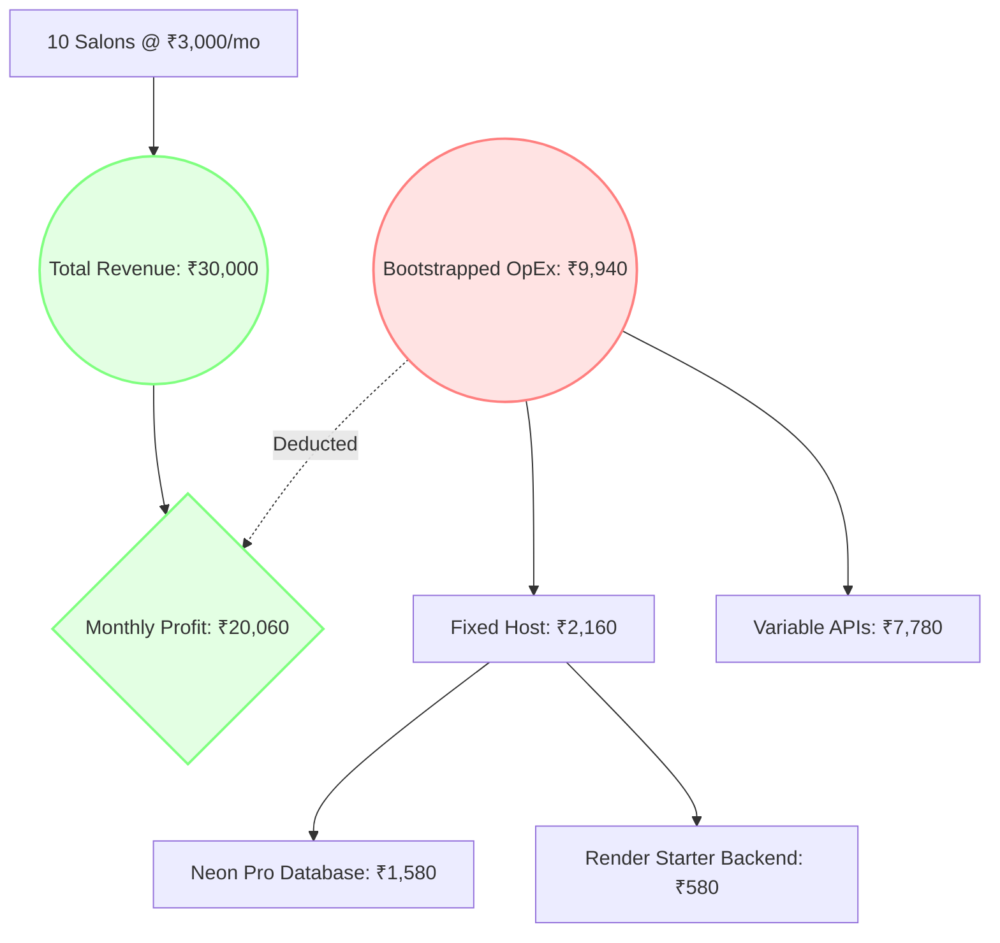

# Fixed-Cost Reduction & Bootstrapping Plan: SalonFlow Platform

This document presents a cost-reduction strategy designed to slash Ongoing Fixed Operating Costs (OpEx) for the initial launch and pilot phases of SalonFlow. By replacing statically provisioned or complex enterprise hosting environments with highly optimized serverless and free-tier alternatives, we can reduce base fixed overhead with zero functionality or security trade-offs.

Calculations and context are integrated from:
*   [financial_analysis_report.md](file:///c:/Users/Devender%20Sharma/.gemini/antigravity/scratch/salonflow/financial_analysis_report.md) - Baseline financial structures.
*   [aws_cost_projections.md](file:///c:/Users/Devender%20Sharma/.gemini/antigravity/scratch/salonflow/aws_cost_projections.md) - Legacy AWS infrastructure costs.
*   [cost_reduction_strategy.md](file:///c:/Users/Devender%20Sharma/.gemini/antigravity/scratch/salonflow/cost_reduction_strategy.md) - Active API usage cost containment.
*   [FIRST_TWO_MONTHS_COST_ANALYSIS.md](file:///c:/Users/Devender%20Sharma/.gemini/antigravity/scratch/salonflow/docs/FIRST_TWO_MONTHS_COST_ANALYSIS.md) - First 2 months cost projection baseline.

---

## 1. Specialist Agents Consultation

### ☁️ Amit (AWS Solutions Architect)
> **Ethos & Insight**: "Let's be frank: the enterprise AWS stack (Fargate, ALB, NAT Gateways, Aurora Serverless) is an overkill for the pilot phase. 
> 
> NAT Gateways ($32/mo) and Load Balancers ($22.50/mo) represent a base network overhead of **$54.50 (₹4,500/mo) before compute or storage even begin**. For onboarding the first 10–50 salons, we should bypass AWS VPC networks completely. 
> 
> Host the backend directly on a public container platform (Render/Railway) and connect to a serverless DB (Neon/Supabase) via SSL. This eliminates the network gateway overhead entirely."

### ⚙️ Rohan (DevOps SRE)
> **Ethos & Insight**: "Bypassing Fargate/AWS ECS also simplifies our deployment pipelines. 
> 
> By running the NestJS backend on **Render's Starter Tier ($7/mo)**, we hook directly into the GitHub repository. Deploys trigger automatically on git push, eliminating the need to maintain AWS ECR registries, Fargate task revisions, or ECS cluster groups. It runs on 512MB RAM which easily manages NestJS event handlers."

### 📈 Aditya (Growth & Revenue Strategist)
> **Ethos & Insight**: "Slashing our fixed hosting overhead alters our pilot unit economics. 
> 
> By lowering monthly fixed costs from ₹12,420 to **₹2,160**, the break-even threshold drops dramatically. Onboarding just **one salon** at our basic ₹3,000/mo plan fully covers our entire fixed infrastructure cost, making the business sustainable from day one."

---

## 2. Bootstrapping vs. Original Fixed Cost Comparison

The table below contrasts our original lightweight hosting stack with the optimized **Bootstrap Hosting Stack**:

| Service Component | Original Hosting Spec | Original Cost (INR) | Bootstrapping Hosting Spec | Bootstrapped Cost (INR) | Savings |
| :--- | :--- | :---: | :--- | :---: | :---: |
| **Relational Database** | AWS RDS Postgres (db.t4g.medium) | ₹6,600 | **Neon Serverless Postgres** (Paid Pro Plan) | **₹1,580 ($19)** | **76%** |
| **Backend Server** | Render Pro Web Service | ₹1,250 | **Render Starter Web Service** (512MB RAM) | **₹580 ($7)** | **53%** |
| **Frontend Web Host**| Vercel Pro (Team Level) | ₹1,660 | **Vercel Hobby Tier** (Free for launch) | **₹0** | **100%** |
| **Authentication** | Clerk Auth Standard Plan | ₹2,080 | **Clerk Free Tier** (Up to 10,000 MAUs) | **₹0** | **100%** |
| **Storage & Backups**| AWS S3 & CloudFront CDN | ₹830 | **Supabase Storage** (5GB Free Tier) | **₹0** | **100%** |
| **Total Fixed Cost** | | **₹12,420 ($150)** | **Production Bootstrap Stack** | **₹2,160 ($26)** | **82.6%** |

> [!TIP]
> **Optional Absolute Minimum Setup (Free Tier DB)**
> During Phase 1 (Setup) and Phase 2 (Shadow Dry-Runs) of Month 1, we can utilize **Neon's Free Tier** (which includes 0.5 GiB of storage and autoscaling compute). This drops our total monthly fixed cost to **₹580 ($7) / month** for the first month. Once live salons onboard in Month 2, we upgrade Neon to the $19/mo Pro Tier to prevent database auto-sleeping.

---

## 3. Financial Projections under Bootstrapping Stack

### Month 1 (Launch & Sandbox Shadowing)
*   **One-Time Setup (CapEx)**: ₹14,000 ($168)
*   **Fixed Hosting (Render Starter + Free Tiers)**: ₹580 ($7)
*   **Variable APIs (Dev dry-runs / Testing)**: ₹1,000 ($12)
*   **Total Month 1 Cost**: **₹15,580 ($187)** *(Down from ₹27,420)*

### Month 2 (Alpha Onboarding - 10 Salons Active)
*   **Fixed Hosting (Render Starter + Neon Paid Pro)**: ₹2,160 ($26)
*   **Variable APIs (15,000 Live conversations)**: ₹7,780 ($94)
*   **Total Month 2 Cost**: **₹9,940 ($120)** *(Down from ₹20,200)*

> [!IMPORTANT]
> **Total Cumulative 2-Month Cost: ₹25,520 ($307)** *(A total savings of 46.4% over the original Option A stack, including setup CapEx).*

---

## 4. Onboarding Margin Analysis (Month 2)

Assuming 10 active pilot salons onboarded at the reduced subscription rate of **₹3,000/month (Basic Plan)**:
*   **Total Gross Revenue (Month 2)**: ₹30,000 ($361)
*   **Total Bootstrapped OpEx (Month 2)**: ₹9,940 ($120)
*   **Net Profit**: **+₹20,060 ($241)**
*   **Gross Operating Margin**: **66.8%**

---

## 5. Implementation Steps to Transition (Rohan & Amit)

1.  **Migrate Database Provider**:
    *   Create a database project on **Neon** or **Supabase**.
    *   Export local schema tables and import them via `prisma db push` or direct sql migrations execution.
2.  **Adjust Backend Service Plan on Render**:
    *   Log in to the Render console.
    *   Select the SalonFlow backend web service.
    *   Go to Settings, select the instance type, and downgrade from **Pro** to **Starter** ($7/mo).
3.  **Adjust Clerk Auth Settings**:
    *   Ensure the active production credentials point to the Clerk account's standard domain settings under the free tier (up to 10,000 MAUs are covered natively).
4.  **Confirm Vercel Billing**:
    *   Deploy the Next.js frontend code repository under a personal/hobby workspace setting on Vercel to bypass the $20/mo team license seat charge.
