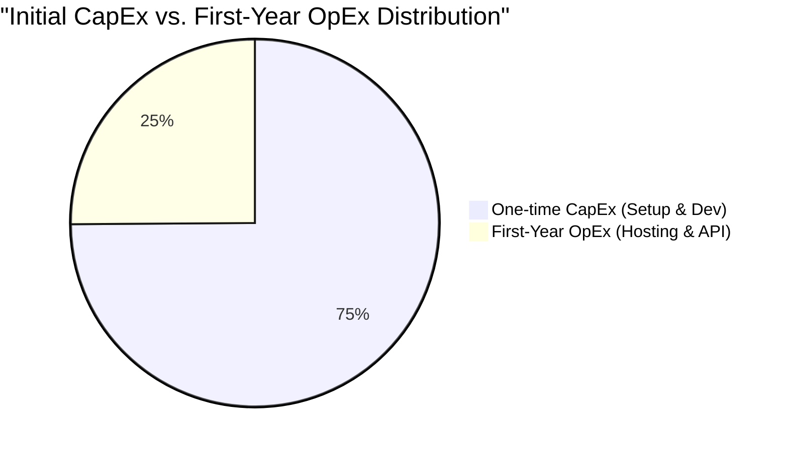
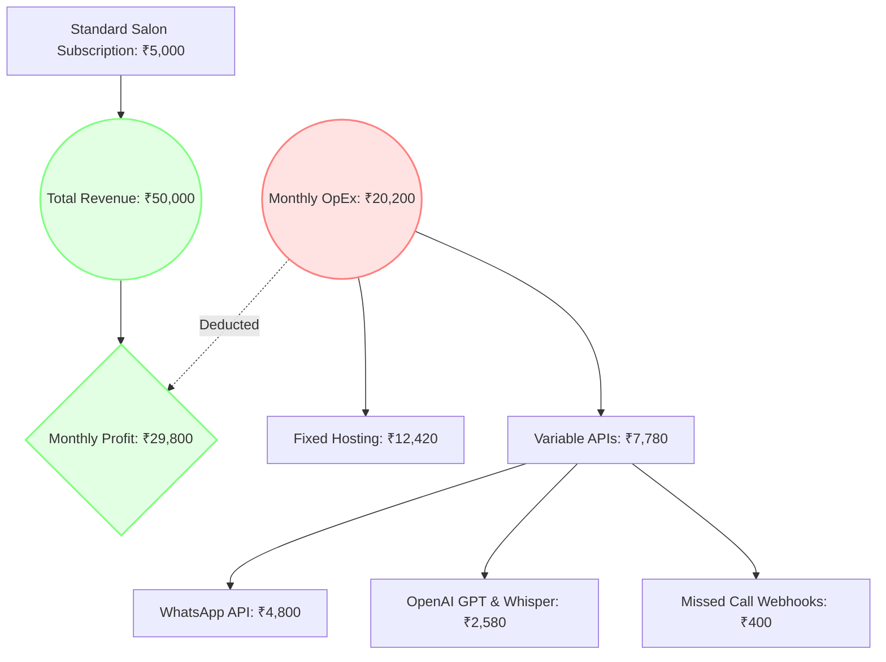

# Financial Analysis Report: SalonFlow Platform Cost Structure

This report provides a detailed breakdown of the costs incurred in developing, launching, and maintaining the SalonFlow SaaS platform. The calculations are presented in both **Indian Rupees (INR)** and **US Dollars (USD)** (assumed exchange rate: 1 USD = 83 INR) based on standard industry rates for the Indian market context.

---

## 1. Executive Summary

The cost structure of SalonFlow is divided into two primary categories:
*   **Capital Expenditures (CapEx)**: Non-recurring one-time costs incurred to design, build, and verify the platform.
*   **Operational Expenditures (OpEx)**: Ongoing fixed and variable costs required to keep the system running in production.



---

## 2. Non-Recurring Setup Costs (CapEx)

These are one-time costs incurred to take the project from ideation to production.

### A. Development & Architecture Audits (Internal Resource Allocation)
Calculated based on standard contracting hours for building a specialized SaaS platform:

| Agent Role | Task / Output | Estimated Hours | Rate per Hour (INR) | Total Cost (INR) | Total Cost (USD) |
| :--- | :--- | :---: | :---: | :---: | :---: |
| **CTO / Architect** | Locking model, schema setup, audit | 80 | ₹2,500 | ₹2,00,000 | $2,410 |
| **Lead Developer** | Logic, Jest testing suites, controller integrations | 120 | ₹1,800 | ₹2,16,000 | $2,602 |
| **UX/UI Designer** | Next.js layout, donut charts, chat simulator | 60 | ₹1,500 | ₹90,000 | $1,084 |
| **Product Manager** | PRD scoping, milestone management | 40 | ₹1,500 | ₹60,000 | $723 |
| **Total Engineering** | | **300** | | **₹5,66,000** | **$6,819** |

### B. One-Time Setup & Licenses
*   **Domain Registration & Premium SSL (2 Years)**: ₹3,500 ($42)
*   **Play Store & App Store Developer Accounts**: ₹10,500 ($126)
*   **Meta Business Verification & WhatsApp Number Setup**: ₹0 (Self-verified)
*   **Total Setup**: **₹14,000 ($168)**

**Total Non-Recurring Costs (CapEx): ₹5,80,000 ($6,987)**

---

## 3. Recurring Fixed Costs (Monthly OpEx)

These costs are billed on a fixed monthly cadence regardless of customer message volumes.

| Infrastructure Provider | Resource / Spec | Monthly Cost (INR) | Annual Cost (INR) | Monthly Cost (USD) |
| :--- | :--- | :---: | :---: | :---: |
| **AWS RDS (PostgreSQL)** | db.t4g.medium (Multi-AZ, 40GB SSD) | ₹6,600 | ₹79,200 | $80 |
| **Render / AWS ECS** | Backend Server (1GB RAM, 0.5 vCPU) | ₹1,250 | ₹15,000 | $15 |
| **Vercel Pro** | Frontend Server (Team plan) | ₹1,660 | ₹19,920 | $20 |
| **Clerk Authentication** | Standard Plan (Up to 10,000 MAU) | ₹2,080 | ₹24,960 | $25 |
| **AWS S3 / Backups** | Storage and CDN backup retention | ₹830 | ₹9,960 | $10 |
| **Total Fixed OpEx** | | **₹12,420** | **₹1,49,040** | **$150** |

```mermaid
bar3d
    title "Monthly Fixed Infrastructure Cost Breakdown (INR)"
    x-axis "Service Component"
    y-axis "Cost in INR"
    "Database (Postgres)" : 6600
    "Authentication (Clerk)" : 2080
    "Frontend (Vercel)" : 1660
    "Backend (Render)" : 1250
    "Storage (S3 Backups)" : 830
```

---

## 4. Variable Costs (Usage-Based Monthly OpEx)

These costs scale linearly with customer volume, messaging frequencies, and AI usage. The following numbers are estimated based on **10 active salons handling an average of 50 conversations (250 message nodes) per day**:

### A. Meta WhatsApp API Cost (Standard Indian Conversational Rates)
Meta charges per 24-hour conversation window. Rates vary by conversation category:
*   **Utility (Confirmations / Reminders)**: ₹0.30 per conversation.
*   **Marketing (Campaign broadcasts)**: ₹0.72 per conversation.
*   **Service (AI Dialogs / FAQ queries)**: ₹0.29 per conversation.

*Calculation (Assuming 15,000 total conversation windows per month across 10 salons):*
*   12,000 Service conversations: 12,000 × ₹0.29 = ₹3,480
*   2,000 Utility conversations: 2,000 × ₹0.30 = ₹600
*   1,000 Marketing conversations: 1,000 × ₹0.72 = ₹720
*   **WhatsApp Total: ₹4,800 ($58) per month**

### B. AI Engine API Consumption (OpenAI API)
*   **GPT-4o-mini completion API**: Input ₹0.0125 per 1K tokens / Output ₹0.05 per 1K tokens.
    *   *Average token use*: 60K tokens/day. Monthly cost: **₹2,080 ($25)**.
*   **OpenAI Whisper (Audio voice note transcription)**: ₹0.50 ($0.006) per minute.
    *   *Average audio duration*: 1,000 minutes/month. Monthly cost: **₹500 ($6)**.
*   **OpenAI Total: ₹2,580 ($31) per month**

### C. Telco Missed Call Callback Telephony
*   Telco API gateway charges: ₹0.10 per webhook ping.
    *   *Volume*: 4,000 missed calls/month. Monthly cost: **₹400 ($5)**.
*   **Telephony Total: ₹400 ($5) per month**

**Total Variable OpEx (Est. for 10 salons): ₹7,780 ($94) per month**
*(Annualized Est. Variable OpEx: ₹93,360 / $1,128)*

---

## 5. Total Cost of Ownership (TCO) Projections

The total cost profile of the project shows strong margin scalability. As more salons join the tenant database, the fixed infrastructure costs are divided, resulting in a highly profitable cost-per-user profile.

### Year 1 Cost Summary (10 Active Salons Setup)
*   **Non-Recurring CapEx (Setup & Dev)**: ₹5,80,000 ($6,987)
*   **Recurring Fixed OpEx (Annual)**: ₹1,49,040 ($1,796)
*   **Recurring Variable OpEx (Annual)**: ₹93,360 ($1,128)
*   **Total Year 1 Expenditure: ₹8,22,400 ($9,911)**

### Unit Economics per Salon (Monthly)
At a hosting cost of ₹12,420 (Fixed) + ₹7,780 (Variable) = **₹20,200 ($244)** total monthly cost for 10 salons:
*   **Monthly Cost per Salon**: **₹2,020 ($24)**
*   **Margin Analysis**: If each salon is charged a subscription fee of **₹5,000 ($60)** per month (BASIC/PRO plans):
    *   *Total Revenue (10 Salons)*: ₹50,000 ($602)
    *   *Total OpEx*: ₹20,200 ($244)
    *   *Gross Monthly Profit*: **₹29,800 ($358) - 59.6% Gross Profit Margin**


