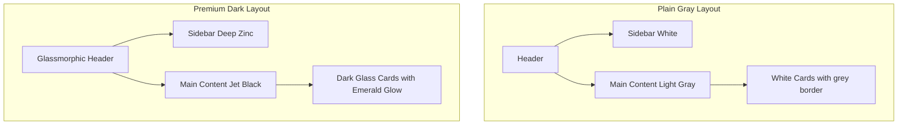

# SalonFlow Premium UI/UX Redesign & Conversion Optimization Plan

Perform a complete UI/UX and product conversion audit across the SalonFlow platform. This document outlines our strategic design findings, severity reviews, copywriting corrections, and the precise code implementation plan to deliver a cohesive, premium, high-density, AI-first SaaS product.

---

## User Review Required

> [!IMPORTANT]
> **Unified Dark Theme Adoption**:
> Currently, the landing and pricing pages use a premium dark theme (`bg-neutral-950`), while the inner dashboard pages, onboarding wizard, and settings use a generic light gray theme (`bg-gray-50`). We propose adopting a unified, premium dark theme (`bg-zinc-950`) across the entire platform. This creates an immediate "wow" factor, feels premium and AI-first, and prevents visual jarring.
> 
> **Terminology & Copywriting Upgrade**:
> We will replace technical jargon with simple, business-centric terms:
> - **Unified Customer Intelligence System (UCIS)** → **Smart Client Database**
> - **Meta Business Credentials & Webhooks** → **WhatsApp Integration Link**
> - **Acquisition Split Percentage Metrics** → **Booking Channel Split**
> - **AI Dispatch Block** → **AI Confirmed Booking**

---

## Open Questions

> [!WARNING]
> **Roster Visibility in Dark Calendar**:
> For the calendar bookings page, moving to a premium dark grid requires careful color styling of individual stylist columns and booking blocks. We propose using subtle dark cards (`bg-zinc-900/50`) with vibrant border colors matching the stylist status. Is this visual choice acceptable, or would you prefer to keep standard black-and-white grids?
> *Proposed Solution*: We will use a premium glassmorphic dark grid layout with emerald-green accents and light border divisions to ensure readability and maintain design premiumness.

---

## 1. UI/UX & Product Design Audit Report

### Spacing & Whitespace Issues
- **Problem**: Full-width tables on screen widths above 1200px (e.g., CRM list, waitlist entries, campaigns) create vast empty margins and stretch rows excessively.
- **Solution**: Set container boundaries to a maximum of `max-w-[1400px]` (already set in some places, but layout blocks are stretched) and group data into compact card grids or multi-column flex blocks.

### Generic SaaS Templates vs. Premium AI-First
- **Problem**: Standard light gray boxes with simple borders look like standard bootstrap or admin templates rather than a high-end AI platform.
- **Solution**: Shift styling to dark-glassmorphism. Use rich HSL background layers, emerald and indigo gradients, glowing border states, hover micro-interactions, and active-duty telemetry loops.

### Visual Density & Hierarchy
- **Problem**: The dashboard lacks immediate visual punch. High-value metrics (like recovery rates and saved revenue) are buried at the same level as standard visit statistics.
- **Solution**: Reorganize the dashboard hierarchy. Group metrics into distinct visual cards (e.g., *AUTOPILOT HIGHLIGHTS*, *REVENUE SAVED*, *LIVE TELEMETRY FEED*) and style the top block with a glowing gradient banner.

---

## 2. Screen-by-Screen Issues List & Severity Scores

| Screen | Observed Design Issue | Severity | Proposed UI Action |
| :--- | :--- | :--- | :--- |
| **Landing Page** | ROI calculator layout is basic; pricing matrices lack premium highlights. | **Medium** | Re-layout with grid columns, add glowing border to CTA, and add a hover interactive scale. |
| **Pricing Page** | Traditional flat tables, lacks premium hover highlighting and trust indicators. | **Medium** | Redesign with premium gradient cards; highlight Pro plan with an emerald border and a badge. |
| **Onboarding** | Step headings feel like technical setup checklists rather than a friendly guide. | **High** | Rewrite onboarding copywriting; style form inputs with dark-glassmorphic inputs. |
| **Dashboard** | Generic SaaS grids, low density, metrics display is passive instead of active. | **High** | Introduce high-density telemetry, active AI feed logs, and interactive booking analytics. |
| **CRM / List** | Massive stretched tables, empty states are text-only. | **Medium** | Design premium empty states with illustrations and quick-action buttons. |
| **CRM Profile** | Stretched tabs, raw JSON-like metrics layout. | **High** | Design structured sidebar for client parameters and a message history feed. |
| **Calendar** | Standard grid layout with plain borders, hard to read on tablets. | **Medium** | Redesign with dynamic height slots and responsive grid templates. |
| **Settings / AI** | Simple layout with large text areas. Custom Instructions lock looks basic. | **Medium** | Create a premium "Locked feature" overlay with an upgrade prompt. |
| **Campaigns** | Text-heavy lists with no visual engagement metrics. | **High** | Group active campaigns by type, display visual progress bars, and highlight response rates. |
| **Voice Notes** | Raw transcripts list, doesn't convey the "Whisper AI" magic. | **High** | Create a waveform visualizer component, play/pause controls, and an active transcript log. |
| **Missed Calls** | Basic table showing logs instead of automated replies. | **High** | Create an alert feed showing how the AI receptionist intervened in real time. |

---

## 3. Copywriting & Wording Improvements

| Original Text / Label | Proposed Salon-Centric Copy | Rationale |
| :--- | :--- | :--- |
| **Unified Customer Intelligence System (UCIS)** | **Smart Client Database** | Simpler for non-technical salon owners to grasp. |
| **Meta Business Phone ID credentials** | **WhatsApp API Link** | Focuses on the business function instead of developer tags. |
| **Acquisition Split Percentage Metrics** | **How Clients Find You** | Makes marketing analytics intuitive. |
| **Today's Revenue Growth (ratio)** | **Revenue Added by Channel** | Directly shows value (manual vs. AI autopilot). |
| **AI Dispatch Block** | **AI Autopilot Reservation** | Feels active, autonomous, and trustworthy. |
| **Offline POS Billing Terminal** | **POS Digital Billing** | Highlights modern utility over raw status. |

---

## 4. Conversion Rate Optimization (CRO) Recommendations
1. **Highlight the "0% Commission" Advantage**: Place a prominent banner on the Landing page and Pricing page contrasting SalonFlow's flat pricing against the 15-20% booking commission charged by competitors.
2. **Interactive WhatsApp Simulator**: Enhance the landing page simulator so salon owners can click to watch Hinglish voice notes convert instantly into calendar slots.
3. **Sandbox Trial CTA**: Ensure the "Start Sandbox Trial" button is present in both header and footer, routing directly to the test-drive sandbox dashboard.

---

## 5. Competitor Comparison Matrix (Pricing & Core AI)

| Strategic Feature | TapGro / Respark | Invoay / Zenoti | SalonFlow |
| :--- | :---: | :---: | :---: |
| **WhatsApp AI Receptionist** | ❌ None | ❌ Standard Templates | **✓ 24/7 Hinglish Autopilot** |
| **Whisper Voice Bookings** | ❌ None | ❌ None | **✓ Instant Transcription** |
| **Missed Call Welcome** | ❌ Manual | ❌ Manual SMS | **✓ Automated WhatsApp** |
| **Booking Commission** | ⚠️ Up to 15% | ⚠️ Up to 10% | **✓ 0% (Flat Subscription)** |
| **Setup Timeline** | 7-14 Days | 14-30 Days | **✓ Sandbox ready in 3 mins** |

---

## 6. Mobile Usability Report
- **Collapsible Navigation**: Ensure the Sidebar folds into a bottom-sheet navigation bar or collapsible side menu on mobile view.
- **Responsive Tables**: Transform all tables into interactive card components on screens under 768px.
- **Tap-friendly Spacing**: Increase button tap targets to `48px` minimum height on settings and calendar actions.

---

## 7. Design System & Typography Recommendations
- **Theme Color Palette**:
  - Background: `bg-zinc-950`
  - Cards & Blocks: `bg-zinc-900` / `border-zinc-800`
  - Accents: Emerald (`text-emerald-500`, `bg-emerald-600`) and Indigo (`text-indigo-400`, `bg-indigo-600`)
- **Typography**: Apply Google Fonts `Outfit` for large display headings (weights 700 to 900) and `Inter` for highly readable numbers and tables.
- **Glassmorphism**: Add a blur utility filter (`backdrop-blur-md bg-zinc-900/60 border border-zinc-800/40`) to top headers and floating panels.

---

## 8. Premium AI SaaS Redesign Proposal

We will transform the frontend dashboard layout into an elegant, dark, high-density console. Here is the structural design before vs. after:

---

## 9. Proposed Changes

Below are the detailed file modifications to implement this comprehensive UI/UX redesign:

### Shared Components & Styles

#### [MODIFY] [globals.css](file:///c:/Users/Devender%20Sharma/.gemini/antigravity/scratch/salonflow/frontend/src/app/globals.css)
- Redefine `:root` colors to use dark slate colors by default.
- Set global text selection color to emerald.
- Add hover scaling utilities.

#### [MODIFY] [layout.tsx](file:///c:/Users/Devender%20Sharma/.gemini/antigravity/scratch/salonflow/frontend/src/app/layout.tsx)
- Correct typography setup to import `Outfit` and `Inter` from `next/font/google` and attach them to the body tags.

#### [MODIFY] [Sidebar.tsx](file:///c:/Users/Devender%20Sharma/.gemini/antigravity/scratch/salonflow/frontend/src/components/layout/Sidebar.tsx)
- Redesign the sidebar using dark theme styling (`bg-zinc-950 border-zinc-900`).
- Ensure navigation links use emerald active highlights (`bg-emerald-950/40 text-emerald-400`).
- Add custom scrolling to avoid overlap cuts.

#### [MODIFY] [TopNav.tsx](file:///c:/Users/Devender%20Sharma/.gemini/antigravity/scratch/salonflow/frontend/src/components/layout/TopNav.tsx)
- Match styling with the dark header theme.
- Style the search inputs as glassmorphic elements.

---

### Pages & Sub-routing

#### [MODIFY] [(dashboard)/layout.tsx](file:///c:/Users/Devender%20Sharma/.gemini/antigravity/scratch/salonflow/frontend/src/app/(dashboard)/layout.tsx)
- Adjust the main background style to use `bg-zinc-950 text-zinc-100` instead of the light gray `bg-gray-50`.

#### [MODIFY] [dashboard/page.tsx](file:///c:/Users/Devender%20Sharma/.gemini/antigravity/scratch/salonflow/frontend/src/app/(dashboard)/dashboard/page.tsx)
- Apply the unified dark theme: replace white cards with dark glassmorphic panels.
- Restructure metrics hierarchy to highlight "Revenue Saved by AI" and "Conversion Rates" first.
- Replace technical jargon with simple, business-centric terms.

#### [MODIFY] [bookings/page.tsx](file:///c:/Users/Devender%20Sharma/.gemini/antigravity/scratch/salonflow/frontend/src/app/(dashboard)/bookings/page.tsx)
- Style the calendar grids to match the dark layout.
- Use high-contrast borders and active appointment markers.

#### [MODIFY] [bookings/page.tsx](file:///c:/Users/Devender%20Sharma/.gemini/antigravity/scratch/salonflow/frontend/src/app/(dashboard)/bookings/page.tsx)
- Style the calendar grids to match the dark layout.
- Use high-contrast borders and active appointment markers.

#### [MODIFY] [waiting-list/page.tsx](file:///c:/Users/Devender%20Sharma/.gemini/antigravity/scratch/salonflow/frontend/src/app/(dashboard)/waiting-list/page.tsx)
- Convert waitlist details into a clean grid of cards with high-density priority labels.

#### [MODIFY] [customers/page.tsx](file:///c:/Users/Devender%20Sharma/.gemini/antigravity/scratch/salonflow/frontend/src/app/(dashboard)/customers/page.tsx)
- Format customer lists to fit into a beautiful dark grid.
- Design sleek onboarding empty-state panels.

#### [MODIFY] [customers/[id]/page.tsx](file:///c:/Users/Devender%20Sharma/.gemini/antigravity/scratch/salonflow/frontend/src/app/(dashboard)/customers/[id]/page.tsx)
- Update profile tabs and visit statistics layout.
- Style preferences blocks to look clean and legible on black backgrounds.

#### [MODIFY] [settings/ai/page.tsx](file:///c:/Users/Devender%20Sharma/.gemini/antigravity/scratch/salonflow/frontend/src/app/(dashboard)/settings/ai/page.tsx)
- Style settings input fields as glassmorphic controls.
- Redesign the premium "locked prompt instructions" card with a glowing modal overlay.

#### [MODIFY] [onboarding/page.tsx](file:///c:/Users/Devender%20Sharma/.gemini/antigravity/scratch/salonflow/frontend/src/app/onboarding/page.tsx)
- Redesign the wizard forms to use dark styling matching the landing page.
- Clean up developer terminology from setup questions.

---

## Verification Plan

### Automated Build Checks
- Run `npm run build` within the frontend workspace to verify that all JSX, Lucide icon imports, and TypeScript typing schemas compile.

### Manual Layout Auditing
1. Compare before/after screenshots of the dashboard landing view to check color consistency.
2. Verify visual density on wide desktop monitor displays (1080p, 1440p).
3. Verify mobile responsiveness of the sidebar, tables, and settings tabs on simulated mobile views.
