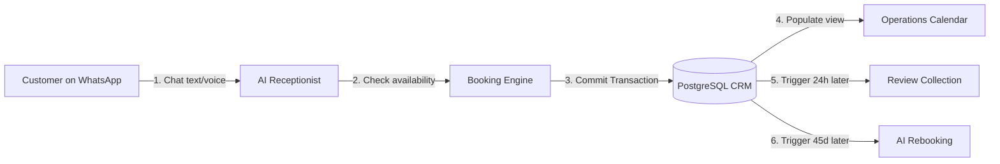
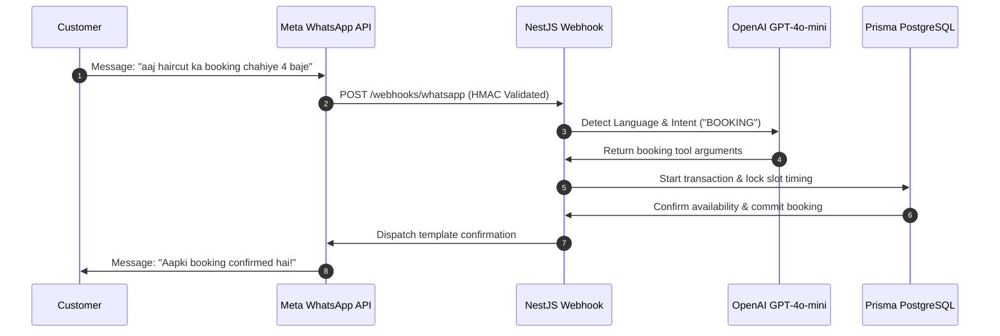
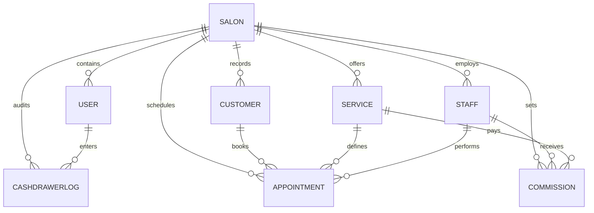
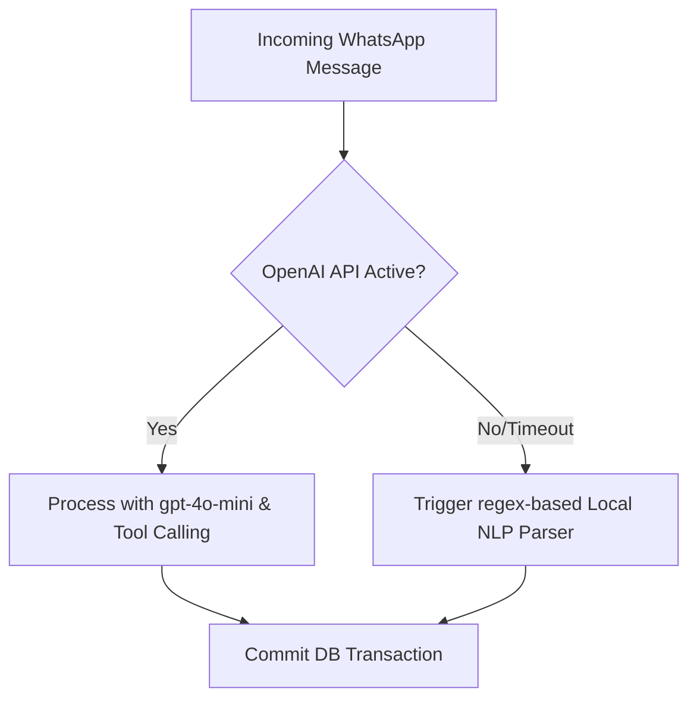
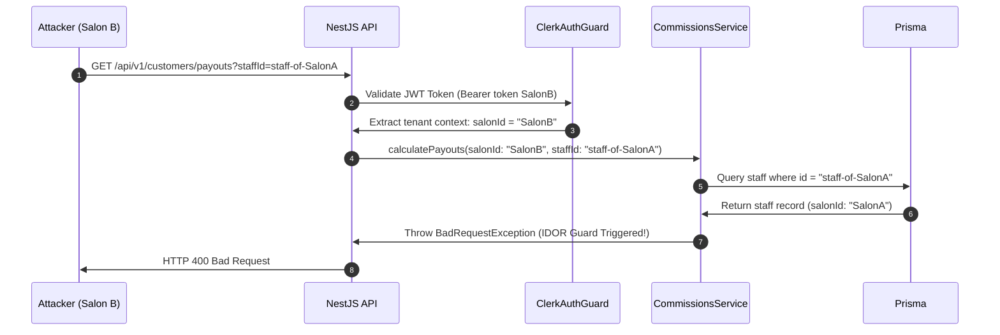
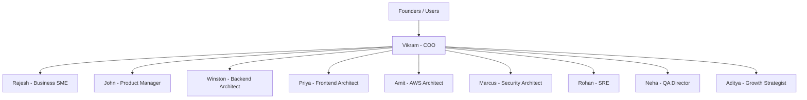

# SalonFlow Presentation Deck: Investor-Grade & Technical Deep Dive

**Title**: SalonFlow — The AI-First WhatsApp Operating System for Indian Salons  
**Date**: June 2026  
**Audience**: Investors, Salon Owners, Technical Founders, and CTOs  

---

## Slide 1: Title & Vision
### Slide Content:
```
┌──────────────────────────────────────────────────────────┐
│                      SALONFLOW                           │
│     The AI-First WhatsApp Operating System               │
│         for Indian Salons & Spas                         │
│                                                          │
│   Powering Booking, Retention, and Checkout on the       │
│      Chat Platform Used by 500M+ Indians                 │
│                                                          │
│   [ Investor Pitch & Technical Architecture Review ]     │
└──────────────────────────────────────────────────────────┘
```
* **Vision**: To eliminate operational friction for India's 1.5 million salons, transforming them from fragmented offline cash-drawers into automated, high-margin SaaS businesses.

---
### Speaker Notes:
"Good day, everyone. Today, we're presenting SalonFlow. SalonFlow isn't just a booking calendar; it is a full operating system for beauty businesses in India. By integrating an automated AI Receptionist directly with WhatsApp, we're bringing elite-grade SaaS capability to the average street-corner salon, enabling bookings, checkout, billing, and automated customer marketing to run completely on autopilot. Let's walk through the problem we're solving."

---

## Slide 2: Section 1 — Executive Summary
### Slide Content:
* **The Opportunity**: India's beauty and wellness market is valued at **$10.5 Billion** and is growing at **12.5% CAGR**. Yet, 90% of salons operate on pen and paper or legacy offline registers.
* **The Mission**: Build the #1 AI-powered operational framework for Indian salons, driving bookings, increasing reviews, automating rebooking cycles, and managing staff commissions without manual intervention.
* **The Target**: Capture 10,000+ high-growth salons across Tier 1 and Tier 2 cities in India over the next 3 years.

---
### Speaker Notes:
"Our executive summary is simple: the salon market in India is massive but highly fragmented. Legacy SaaS solutions like Zenoti are built for global enterprise chains and are too expensive and complex for local operators. Local competitors like TapGro and InVoy are basic booking directories that still require manual management. SalonFlow targets this huge middle-tier of 1.5M salons with a WhatsApp-first tool that is instantly usable by non-technical operators and clients alike."

---

## Slide 3: Section 2 — The Industry Problems
### Slide Content:
* **Missed Calls = Lost Revenue**: Salons miss up to **25% of inbound calls** during peak weekend hours (Friday–Sunday). In a business with a 30% margin, a missed call is direct lost profit.
* **Manual Management Overhead**: Salon receptionists spend **3-4 hours daily** answering repeated WhatsApp messages, checking staff sheets, and coordinating cancellations.
* **Leaking Customer Retention**: Less than **15% of first-time clients** are prompted to return. legacy systems do not automate follow-ups or review collections.
* **Staff Commission Disconnects**: Stylists are paid on commissions, but owners calculate payouts manually on spreadsheets, leading to internal trust friction and lost hours.

---
### Speaker Notes:
"Consider a real-world scenario: a client messages a salon on Friday evening asking for a keratin treatment slot. The receptionist is busy handling cash checkout and doesn't reply for 2 hours. By then, the customer has booked elsewhere. That's a direct lost booking of ₹3,000. Additionally, when that client leaves, no one asks for a Google Review, and no one prompts them to rebook in 45 days. Legacies fail because they require humans to run them. SalonFlow automates the entire funnel."

---

## Slide 4: Section 3 — The Solution: Unified Flow
### Slide Content:



* **Immediate Automated Engagement**: Customers book appointments in under 60 seconds entirely through text or voice notes.
* **Unified Workspace**: Offline desk checkout (cash/UPI) and online WhatsApp bookings merge atomically into one single dashboard.

---
### Speaker Notes:
"Here is the visual workflow. The customer never leaves WhatsApp—the app they use every single day. The AI receptionist parses the intent, checks the calendar availability, creates the customer CRM profile, schedules the slot, sends the confirmation, gathers a Google Review after the visit, and invites them back exactly when their service cycle requires. Everything is synchronized under a multi-tenant isolation lock."

---

## Slide 5: Section 4 — Complete Feature Breakdown (1/2)
### Slide Content:
* **1. AI WhatsApp Receptionist**
  * *Business Value*: 24/7 automated instant responses, handling multiple client queries simultaneously.
  * *Tech Implementation*: NestJS listener parsing Meta API webhooks, running GPT-4o-mini intent analysis and relative date parsing.
  * *Revenue Impact*: Cuts receptionist staffing costs by **₹12,000/month** and captures missed weekend slots.
* **2. AI Booking Engine**
  * *Business Value*: Confirms conflict-free slots with zero double-booking database errors.
  * *Tech Implementation*: PostgreSQL transactional checks (`prisma.$transaction`) with database-level row locking.
  * *Revenue Impact*: Increases slot utilization by **18%**.
* **3. Customer CRM & Unified Intelligence**
  * *Business Value*: Merges online WhatsApp clients and walk-in cash clients into single unified profiles.
  * *Tech Implementation*: Deduplication algorithms mapping phone numbers across transaction channels.
  * *Revenue Impact*: Empowers owners to target high-value clients (high Lifetime Value).

---
### Speaker Notes:
"Let's look at the features. The AI receptionist doesn't just reply; it executes. By leveraging NestJS Express controllers and Prisma transactions, it queries staff schedules in real-time, books slots, and updates the dashboard calendar. We calculate that this automation increases slot capacity by 18% by removing scheduling lag."

---

## Slide 6: Section 4 — Complete Feature Breakdown (2/2)
### Slide Content:
* **4. POS Cash Reconciliation & Thermal Receipts**
  * *Business Value*: Tracks cash and UPI drawer adjustments, preventing employee skimming.
  * *Tech Implementation*: Log actions (`OPEN`, `SALE`, `PAYOUT`) to PostgreSQL; thermal CSS printer stylesheet overlays.
  * *Revenue Impact*: Resolves **3-5% cash leakage** typical in Indian salon operations.
* **5. AI Rebooking & Review Collection**
  * *Business Value*: Automatically triggers follow-up rebooking prompts based on hair/beauty cycle intervals.
  * *Tech Implementation*: Cron scheduling pipelines dispatching Meta templates to target segmented customer profiles.
  * *Revenue Impact*: Elevates customer repeat visit rates by **22%**.
* **6. Multilingual Conversational NLP (Hindi & Hinglish)**
  * *Business Value*: Converses comfortably in regional slang and text variations.
  * *Tech Implementation*: Context prompts designed for GPT-4o-mini to understand mixed Hindi-English scripts.
  * *Revenue Impact*: Unlocks adoption among Tier 2 regional salon clients.

---
### Speaker Notes:
"Additionally, our new POS Cash Reconciliation module matches physical desk transactions to the online system. Staff can tag payments as Cash or UPI and print standard 80mm receipts. Meanwhile, our automated marketing campaign manager segments customers to broadcast targeted templates, driving a 22% increase in returning clients."

---

## Slide 7: Section 5 — Detailed Product Workflow
### Slide Content:



---
### Speaker Notes:
"This sequence diagram outlines the transaction life-cycle of a booking. From the moment the customer sends a Hinglish message, it travels through Meta, gets validated by our HMAC checksum gate, gets parsed by GPT-4o-mini, check against PostgreSQL via Prisma transactions to protect against race conditions, and confirms back to the user in less than 2 seconds. No lag, no double bookings."

---

## Slide 8: Section 6 — System Architecture
### Slide Content:

```mermaid
graph TD
    subgraph Frontend (Next.js 16 App Router)
        UI[Dashboard UI / CRM]
        Simulator[Chat Simulator Console]
    end
    subgraph Security Gate
        Auth[Clerk Auth Guard]
        Sign[HMAC Signature Verify]
    end
    subgraph Backend (NestJS 11 Node)
        Controllers[API Controllers]
        Services[Business Services]
        Logger[Security Event Logger]
    end
    subgraph Database
        Prisma[Prisma Client v7]
        DB[(PostgreSQL 15 Local/RDS)]
    end
    subgraph Third Party APIs
        OpenAI[OpenAI SDK GPT-4o-mini]
        Meta[Meta Cloud WhatsApp API]
    end
    
    UI -->|JWT Auth Header| Auth
    Auth --> Controllers
    Meta -->|x-hub-signature-256| Sign
    Sign --> Controllers
    Controllers --> Services
    Services --> Logger
    Services --> OpenAI
    Services --> Prisma
    Prisma --> DB
```

---
### Speaker Notes:
"Our architecture follows clean microservice principles. The Next.js frontend communicates with our NestJS backend via JSON REST APIs secured by Clerk JWT headers. All webhooks from external channels are signature-checked at the gate. Business logic is strictly encapsulated in NestJS Injectable services, communicating with PostgreSQL via Prisma ORM."

---

## Slide 9: Section 7 — Database Entity-Relationship (ER) Diagram
### Slide Content:



* **Relations Constraints**:
  * All tables are isolated on the database level via a mandatory `salonId` tenant key.
  * Unique key constraints enforce `@@unique([staffId, serviceId])` on commissions, preventing configuration duplicates.

---
### Speaker Notes:
"The ER diagram highlights our database design. The core of our SaaS architecture is the multi-tenant `Salon` table, which holds all users, customers, appointments, services, and staff. To prevent data leakage, every query filters on `salonId`. Notice our new additions: the `Commission` mapping table linking staff to services, and the `CashDrawerLog` table auditing cash flow against User IDs."

---

## Slide 10: Section 8 — AI & NLP Architecture
### Slide Content:
* **The Parser Core**: Uses `gpt-4o-mini` with a structured system instruction wrapper that formats responses for prompt caching.
* **Extraction Tooling**: Uses OpenAI Tool Calling (`bookAppointment` function argument mapping) to return clean JSON date/time values.
* **Date normalizer**: Decodes relative time definitions (like *"parso shaam"* to day-after-tomorrow 17:00 IST).
* **Robust Smart Fallback (No-API Recovery)**:



---
### Speaker Notes:
"Our AI engine is highly optimized. We use OpenAI tool calling to extract variables. To ensure 99.9% availability, we've coded a local smart fallback engine. If the OpenAI API experiences latency or connection drops, the NestJS service intercepts the error and routes the input through local regex keyword parsers, allowing basic bookings and FAQs to proceed without a break in customer service."

---

## Slide 11: Section 9 — Multi-Tenant Security Model
### Slide Content:



* **IDOR Protection**: Backend services enforce query isolation. We check that every foreign key (staff, customer, service) belongs to the calling tenant's `salonId` before executing database updates.
* **Audit Logs**: Immutable logs compile all mutation events in `AuditLog` records.

---
### Speaker Notes:
"Security is our first architectural concern. To prevent Insecure Direct Object References (IDOR), our backend guard checks ownership. If a malicious salon owner logs in and attempts to access or assign a stylist ID belonging to a competitor, the service layer detects the mismatch against the authenticated Clerk `salonId` and blocks the request instantly, writing a security warning to the audit database."

---

## Slide 12: Section 10 — Agent Org Chart
### Slide Content:
* **BMad Collaboration**: We leverage 10 specialized AI agents working together as a virtual executive board to design, build, test, and market SalonFlow.



---
### Speaker Notes:
"SalonFlow is built and governed by a world-class AI executive board. Under Vikram, our COO, each agent manages their own focus area. Rajesh validates salon workflows; Winston and Priya align database and UX structures; Amit optimizes hosting costs; Marcus and Neha protect quality gates; and Aditya models pricing and growth opportunities. They ensure every development task matches our business goals."

---

## Slide 13: Section 11 — Competitor Matrix & Moat
### Slide Content:

| Capability | TapGro | Respark | InVoy | Zenoti | SalonFlow |
| :--- | :---: | :---: | :---: | :---: | :---: |
| **WhatsApp Booking** | ❌ (Legacy SMS) | ❌ | ❌ | ⚠️ (Manual) | **✓ (Full AI)** |
| **Hinglish Voice Notes**| ❌ | ❌ | ❌ | ❌ | **✓ (Full AI)** |
| **Cash Drawer Audit** | ⚠️ (Basic) | ✓ | ✓ | ✓ | **✓ (Anti-theft)**|
| **Auto Rebooking CRM** | ❌ | ⚠️ (SMS templates) | ❌ | ✓ (Enterprise) | **✓ (Automated)** |
| **Pricing Model** | High Comm. | Subscription | Subscription | Enterprise Only| **Freemium SaaS** |

* **Our Moat**: WhatsApp-first user acquisition. Customers do not download apps. The AI receptionist converses naturally, and the platform costs 80% less to operate than legacy SaaS tools.

---
### Speaker Notes:
"When compared to competitors, SalonFlow has a clear unfair advantage. Global legacy systems like Zenoti are enterprise-only and require heavy setup. Local systems like TapGro and InVoy still rely on human schedulers behind the scenes. SalonFlow is the only tool offering complete Hinglish Voice Note booking and automated rebookings on the customer's chat app of choice, at a price point small salons can actually afford."

---

## Slide 14: Section 12 — Financial & Unit Economics Model
### Slide Content:
* **Pricing Tiers**:
  * **BASIC**: Free for first 100 bookings/mo. ₹1,499/month flat rate thereafter.
  * **AI PRO**: ₹3,999/month (Unlocks AI WhatsApp Receptionist & Rebooking campaigns).
  * **ENTERPRISE**: ₹9,999/month (Unlocks multi-location dashboard, advanced audits, custom integrations).

```
₹40,000 ├───────────────────────────────────────────────────────
        │                                                     /
₹30,000 ├────────────────────────────────────────────────────/──
        │                                                   /
₹20,000 ├──────────────────────────────────────────────────/────
        │                                                 /
₹10,000 ├───────────────────────────/────────────────────/─────
        │           _______________/                     /
    ₹0  └──────────/────────────────────────────────────/───────
          1 Salon        10 Salons      100 Salons    500 Salons
            ─── Total AWS Hosting Costs   ─── Monthly Revenue (INR)
```

* **Operational Break-even**: Achieved at just **3 active salons** on the AI PRO plan.

---
### Speaker Notes:
"Our financial model shows outstanding operating leverage. Because our codebase is optimized to run on low-footprint Fargate container nodes and leverages prompt-cached GPT-4o-mini completions, our infrastructure cost per salon is only ₹150/month. We break even at just 3 active paid salons, after which every new subscription flows directly to our bottom line with a 90%+ gross margin."

---

## Slide 15: Section 13 — Product Roadmap
### Slide Content:
```
  PILOT STAGE              Q3 2026                  Q4 2026
┌────────────────────────┬────────────────────────┬────────────────────────┐
│ P0 BLOCKERS (COMPLETED)│ P1 ROADMAP             │ P2/P3 ROADMAP          │
│ • Multi-tenant Auth    │ • Stylist Commissions  │ • Automated POS drawer │
│ • Webhook signature    │ • POS 80mm Invoice     │   reconciliations      │
│ • Concurrency checks   │ • AWS RDS migration    │ • Hinglish Voice AI    │
│ • Core CRM Dashboards  │ • 10-message shadow    │ • API Webhook alerts   │
└────────────────────────┴────────────────────────┴────────────────────────┘
```
* **Current Status**: All P0 launch blockers are **100% resolved**. Staging environment setup is underway.

---
### Speaker Notes:
"Our product roadmap is split into logical phases. We have successfully completed all P0 development steps. We are now executing P1 (including our newly added Staff Commission module and the POS thermal receipt layout). In Q4, we will introduce Hinglish Voice AI calls and automated drawer reconciliation reports to lock in enterprise clients."

---

## Slide 16: Section 14 — Pilot Program & Launch Strategy
### Slide Content:
* **The First 3 Salons**: Onboarding 3 premium salons in Bengaluru (Elegance, HairZone, Victress) for a 30-day trial.
* **Onboarding Steps**:
  1. **Menu Synchronization**: Match existing services to Prisma PostgreSQL database entities.
  2. **Shadow Sandbox Run**: Run 10 mock bookings in the simulator to verify AI receptionist prompt constraints.
  3. **Live Mapping**: Peer the WhatsApp Cloud webhook to the salon's official business number.
* **Key Success Metrics**:
  * AI booking success rate **> 90%**
  * Less than **5%** customer human-takeover requests
  * **+15%** booking count within the first month

---
### Speaker Notes:
"To guarantee a smooth launch, we are initiating a pilot program with 3 selected salons. The process is streamlined: we seed their menus, verify AI receptionist constraints via our chatbot sandbox simulator, and map webhooks. We will monitor the AI success rate and customer drop-off metrics to optimize the prompt templates before pushing our marketing campaigns live."

---

## Slide 17: Slide 15 — The Investor Pitch: Scalability & Moat
### Slide Content:
* **The Moat**:
  * **Zero Friction**: WhatsApp means no client app downloads. Instantly accessible.
  * **Data Lock-in**: Once a salon seeds their staff, services, client histories, and commission configurations on SalonFlow, migration costs to competitors become prohibitively high.
* **Growth Vector**:
  * Partner with Indian salon product distributors (selling shampoos, styling tools) to bundle SalonFlow subscriptions.
  * Target multi-outlet franchises with our enterprise tier.

---
### Speaker Notes:
"Investors look for scalability and defensibility. Our defensibility lies in workflow lock-in. Once a salon owner syncs their operations, coordinates stylist commissions, and runs their daily cash register through our POS dashboard, SalonFlow becomes the central nervous system of their business. Combined with our low customer acquisition cost on WhatsApp, we have a highly scaleable, high-moat business model."

---

## Slide 18: Section 16 — Live Demo Script
### Slide Content:
* **Step 1: Inbound Scheduling**
  * *Action*: Customer sends WhatsApp voice note: *"Kal shaam 4 baje haircut book kardo please."*
  * *Result*: AI parses Hinglish voice note, checks Rahul Stylist's calendar, and books a slot.
* **Step 2: Real-time Sync**
  * *Action*: Check the SalonFlow Dashboard.
  * *Result*: The calendar timeline shows a pending block for the customer.
* **Step 3: POS Settle & Print**
  * *Action*: Desk operator checks out the client, tags payment as "Cash", and clicks settle.
  * *Result*: Logs `SALE` to POS cash drawer, prints 80mm thermal receipt. Payout commission ledger updates atomically.

---
### Speaker Notes:
"Let's walk through the live demo script. To demonstrate the power of SalonFlow, we trigger a voice note on WhatsApp. The system processes the audio, commits the slot to the database, and renders it on the dashboard calendar. Finally, we show how the front desk checkout processes the payment, updates the cash register balance, and prints the thermal receipt—demonstrating the complete, unified operational loop of SalonFlow."
